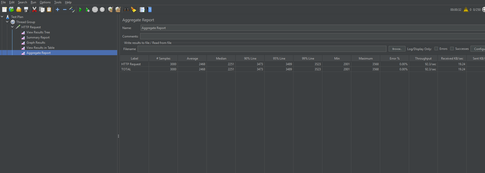
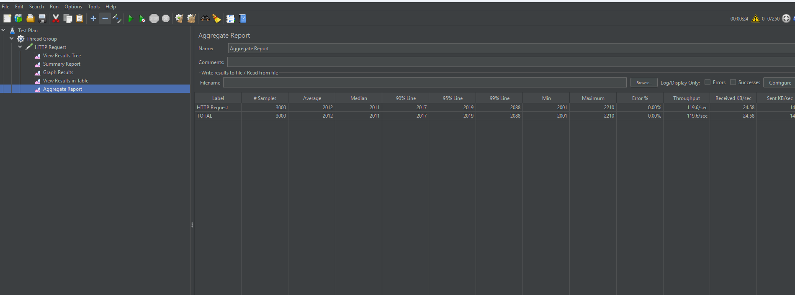

# Java 21 Virtual Threads POC

A minimal Spring Boot POC demonstrating the performance difference between platform threads and virtual threads (Project Loom) when handling concurrent I/O-bound workloads.

## What this POC shows

PostgreSQL and most blocking I/O operations park the calling thread while waiting. With platform threads (OS threads), each blocked thread occupies a fixed OS resource — throughput is capped by thread pool size.

Virtual threads are cheap JVM-managed threads. When a virtual thread blocks on I/O, the underlying carrier thread is freed to run other virtual threads. This means thousands of concurrent requests can be handled without a proportionally large thread pool.

## Stack

- Java 21
- Spring Boot 4.0.6
- Gradle 9.4.1

## Running locally

```bash
./gradlew bootRun
```

The app starts on `http://localhost:8080`.

## Endpoint

| Method | Path | Description |
|--------|------|-------------|
| GET | `/io-task` | Simulates a 2-second blocking I/O operation, returns the thread name |

```bash
curl http://localhost:8080/io-task
# Response: virtual-38   (virtual thread name when enabled)
# Response: http-nio-8080-exec-1  (platform thread name when disabled)
```

## Virtual threads toggle

Controlled by a single property in [application.properties](src/main/resources/application.properties):

```properties
spring.threads.virtual.enabled=true   # enable virtual threads
spring.threads.virtual.enabled=false  # revert to platform threads (Tomcat thread pool)
```

## Performance test results (JMeter)

Load test: 500 concurrent users, 2-second I/O delay per request.

**Platform threads** — Tomcat default thread pool (200 threads). Requests queue up once the pool is exhausted.



**Virtual threads** — One virtual thread per request. No queuing, no pool exhaustion.



The JMeter test plan is in [Aggregate Report.jmx](Aggregate%20Report.jmx).

## Key concepts

**Why virtual threads are not always the answer**
- CPU-bound tasks: no benefit — you're still bounded by CPU cores, not thread count
- Libraries that use `ThreadLocal` heavily may behave unexpectedly (e.g. connection pools that pin threads)
- `synchronized` blocks pin the carrier thread — use `ReentrantLock` instead in hot paths

**What changes in Spring Boot with `spring.threads.virtual.enabled=true`**
- Tomcat executor switches to `VirtualThreadTaskExecutor`
- `@Async` tasks run on virtual threads
- `@Scheduled` tasks run on virtual threads

**What does NOT change**
- Your application code — no `async`/`await`, no reactive types, no `CompletableFuture` required
- Thread safety rules — virtual threads are still threads, shared mutable state still needs synchronisation
