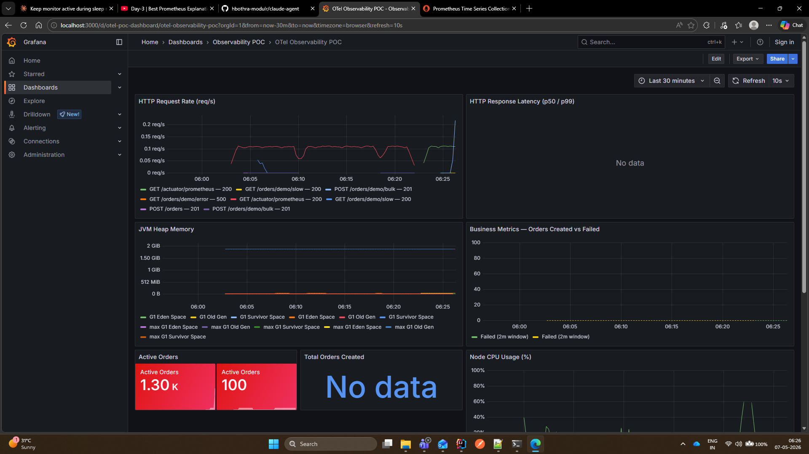
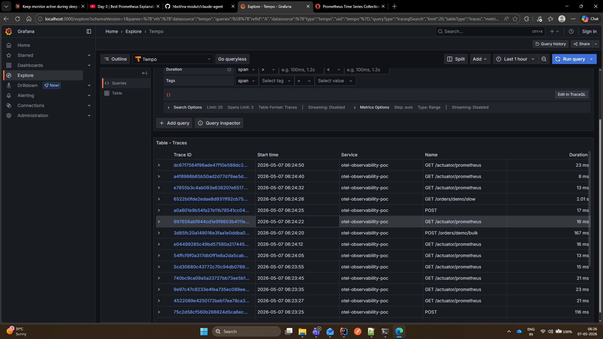

# OTel + Prometheus + Grafana — 3-Pillar Observability POC

A Spring Boot 4.x application wired to the full Grafana observability stack.
Covers all three pillars: **metrics**, **logs**, and **traces** — with cross-pillar correlation.

---

## Stack

| Component | Role | Port |
|---|---|---|
| Spring Boot app | Order REST API | 8081 (host) → 8080 (container) |
| OTel Java Agent | Auto-instruments HTTP + injects trace IDs into logs | (JVM agent) |
| OTel Collector | Receives OTLP traces, forwards to Tempo | 4317 (gRPC), 4318 (HTTP) |
| Prometheus | Scrapes `/actuator/prometheus`, stores time-series | 9090 |
| Loki | Receives log lines pushed by Loki4j appender | 3100 |
| Tempo | Stores distributed traces, serves Grafana queries | 3200 |
| Grafana | Single pane: metrics + logs + traces | 3000 |
| Node Exporter | Host CPU / memory / disk metrics | 9100 |

---

## Quick Start

```bash
# First run — builds the app image + downloads OTel agent (~200 MB, ~5 min)
docker compose up --build

# Subsequent runs — uses cached image
docker compose up

# Run in background (detached)
docker compose up -d
```

Open **Grafana** → http://localhost:3000 (no login required)

---

## Screenshots

### Grafana Dashboard — Metrics (Prometheus)
> HTTP request rate · HTTP p99 latency · JVM heap · Business metrics (orders created/failed) · Active orders · Node CPU



### Grafana Explore — Tempo Traces
> Live traces for every request: GET /actuator/prometheus, POST /orders/demo/bulk, GET /orders/demo/slow — with duration, service name, and span name visible



---

## Cleanup

Everything is namespaced under the Docker Compose project `otel-poc`.
All containers are prefixed `otel-poc-*`, volumes are `otel-poc_*`.

```bash
# Stop all containers (keeps volumes and images)
docker compose down

# Stop + delete all named volumes (Prometheus TSDB, Loki chunks, Tempo blocks, Grafana state)
docker compose down --volumes

# Stop + delete volumes + the locally-built app image
docker compose down --volumes --rmi local

# Nuclear option — stop + delete volumes + ALL pulled images (prometheus, grafana, loki, tempo, …)
docker compose down --volumes --rmi all
```

### Verify what's running / what exists

```bash
# All containers belonging to this POC
docker ps -a --filter "label=project=otel-poc"

# All named volumes for this POC
docker volume ls --filter "label=project=otel-poc"

# The built app image
docker images --filter "label=project=otel-poc"

# Remove only the built app image (force-delete even if tagged)
docker images --filter "label=project=otel-poc" --filter "label=component=spring-boot-app" -q `
  | ForEach-Object { docker rmi -f $_ }
```

### Manual nuclear cleanup (if docker compose down fails)

```bash
# Stop and remove all otel-poc containers
docker ps -a --filter "label=project=otel-poc" -q | ForEach-Object { docker rm -f $_ }

# Remove all otel-poc volumes
docker volume ls --filter "label=project=otel-poc" -q | ForEach-Object { docker volume rm $_ }

# Remove the built image
docker images --filter "label=project=otel-poc" -q | ForEach-Object { docker rmi -f $_ }
```

---

## Pillar 1 — Metrics (Prometheus + Grafana)

### How it works
```
Spring Boot app
  └─ Micrometer /actuator/prometheus  ←── Prometheus scrapes every 10 s
                                               │
Node Exporter (host metrics)          ←── Prometheus scrapes every 15 s
                                               │
                                           Grafana queries Prometheus
```

### What you get automatically (zero config)
- `http_server_requests_seconds` — count, sum, histogram per method/URI/status
- `jvm_memory_used_bytes`, `jvm_gc_pause_seconds`, `jvm_threads_live_threads`
- `process_cpu_usage`, `system_cpu_count`
- `node_cpu_seconds_total`, `node_memory_MemAvailable_bytes` (Node Exporter)

### Custom business metrics (`BusinessMetrics.java`)
| Metric | Type | Description |
|---|---|---|
| `orders_created_total` | Counter | Total orders created |
| `orders_failed_total` | Counter | Total orders that failed validation |
| `orders_active` | Gauge | Orders currently held in memory |
| `orders_processing_duration_seconds` | Timer (histogram) | End-to-end order creation time |

### PromQL examples
```promql
# Request rate
rate(http_server_requests_seconds_count{application="otel-observability-poc"}[1m])

# p99 latency
histogram_quantile(0.99, rate(http_server_requests_seconds_bucket[1m]))

# JVM heap used
jvm_memory_used_bytes{area="heap"}

# Node CPU usage
1 - avg(rate(node_cpu_seconds_total{mode="idle"}[1m]))
```

---

## Pillar 2 — Traces (OTel Agent → OTel Collector → Tempo → Grafana)

### How it works
```
Spring Boot JVM
  └─ OTel Java Agent (-javaagent)
       ├─ Auto-instruments: Spring MVC, Tomcat, JDBC, Kafka, …
       ├─ @WithSpan on service methods → child spans
       └─ OTLP HTTP → OTel Collector :4318
                           │
                       OTel Collector
                           └─ OTLP gRPC → Tempo :4317 (internal Docker network)
                                               │
                                           Grafana queries Tempo :3200
```

### Agent configuration (env vars in docker-compose)
```yaml
OTEL_SERVICE_NAME:            otel-observability-poc
OTEL_EXPORTER_OTLP_ENDPOINT:  http://otel-collector:4318
OTEL_EXPORTER_OTLP_PROTOCOL:  http/protobuf
OTEL_TRACES_EXPORTER:         otlp
OTEL_METRICS_EXPORTER:        none   # Prometheus handles metrics
OTEL_LOGS_EXPORTER:           none   # Loki4j handles logs
```

### Custom spans
```java
@WithSpan("order.create")
public Order createOrder(
    @SpanAttribute("customer.id") String customerId,
    @SpanAttribute("order.product") String product,
    double amount) { … }
```

Each `@WithSpan` creates a child span inside the HTTP server span.
`@SpanAttribute` adds the argument value as a span attribute visible in Tempo.

### Viewing traces in Grafana
1. Grafana → Explore → select **Tempo** datasource
2. Query type: **Search** → Service Name: `otel-observability-poc`
3. Or TraceQL:
   ```
   {}                          # all traces
   { duration > 500ms }        # slow spans only
   { status = error }          # error spans only
   ```

---

## Pillar 3 — Logs (Loki4j → Loki → Grafana)

### How it works
```
Spring Boot app
  └─ Logback + Loki4jAppender
       └─ HTTP POST batches → Loki :3100
                                   │
                               Grafana queries Loki
```

The OTel Java Agent automatically injects `trace_id` and `span_id` into
Logback MDC for every active span. Every log line emitted during a request
carries these IDs — no manual code needed.

### Log format (Loki message body)
```
level=INFO trace_id=4bf92f3577b34da6a3ce929d0e0e4736 span_id=00f067aa0ba902b7 logger=…OrderService message=Order created orderId=…
```

### LogQL examples
```logql
{app="otel-observability-poc"}                    # all app logs
{app="otel-observability-poc", level="ERROR"}     # errors only
{app="otel-observability-poc"} |= "orderId=abc"  # filter by order ID
```

### Trace → Log correlation
In Grafana, from any Tempo trace span click **"Logs for this span"**.
Grafana uses the `trace_id` derivedField configured in `datasources.yml` to jump
straight to the matching Loki log lines.

---

## Cross-Pillar Correlation

```
Grafana Dashboard
  ├─ HTTP latency metric panel → click a data point with high latency
  │    └─ Exemplar link (if enabled) → jumps to the specific Tempo trace
  │
  ├─ Tempo trace view → click a span
  │    └─ "Logs for this span" → jumps to Loki log lines for that trace_id
  │
  └─ Loki log line → click the trace_id value
       └─ Jumps back to Tempo trace
```

---

## API Endpoints

```bash
# Create an order
curl -X POST http://localhost:8081/orders \
  -H "Content-Type: application/json" \
  -d '{"customerId":"cust-1","product":"laptop","amount":999}'

# Get an order
curl http://localhost:8081/orders/{id}

# List all orders
curl http://localhost:8081/orders

# Cancel an order
curl -X DELETE http://localhost:8081/orders/{id}

# Bulk create (generates load quickly)
curl -X POST "http://localhost:8081/orders/demo/bulk?count=10"

# Slow endpoint — triggers 2 s span (watch latency panel spike)
curl http://localhost:8081/orders/demo/slow

# Error endpoint — produces red error span in Tempo + ERROR log in Loki
curl http://localhost:8081/orders/demo/error

# Bad amount — triggers orders_failed_total counter
curl -X POST http://localhost:8081/orders \
  -H "Content-Type: application/json" \
  -d '{"customerId":"bad","product":"x","amount":-5}'
```

---

## Kubernetes Equivalent

| Docker Compose | Kubernetes |
|---|---|
| `app` service | `Deployment` + `Service` |
| `otel-collector` | `Deployment` (central) or `DaemonSet` (per-node), managed by **OTel Operator** |
| `prometheus` | **kube-prometheus-stack** Helm chart with `ServiceMonitor` CRDs |
| `node-exporter` | **`DaemonSet`** — one pod per node, mounts host `/proc` and `/sys` |
| `loki` | **Grafana Loki** Helm chart (`StatefulSet` + object storage backend) |
| `tempo` | **Grafana Tempo** Helm chart (`Deployment` + object storage backend) |
| `grafana` | **Grafana** Helm chart |
| prometheus.yml scrape config | `ServiceMonitor` CRD — Prometheus Operator auto-discovers pods |
| OTel env vars | Set via `Deployment.spec.containers.env` or injected by OTel Operator annotation `instrumentation.opentelemetry.io/inject-java: "true"` |
| Docker volume | `PersistentVolumeClaim` |
| Docker network | Kubernetes cluster DNS — services resolve by name within namespace |

In K8s, the OTel Operator can inject the Java agent automatically into any pod
via a single annotation — no Dockerfile changes needed:
```yaml
metadata:
  annotations:
    instrumentation.opentelemetry.io/inject-java: "true"
```
